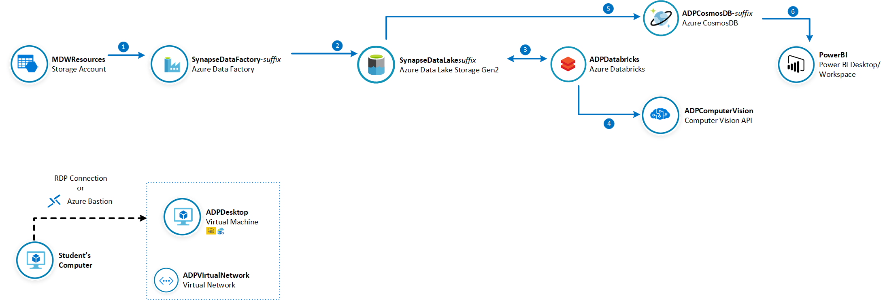
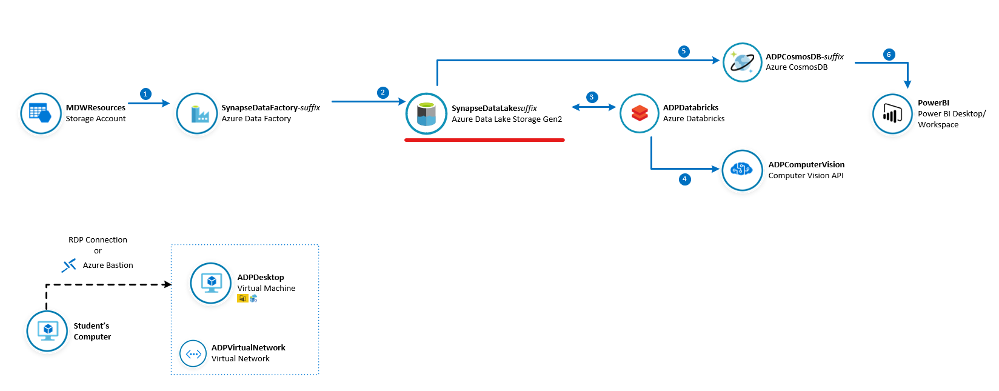
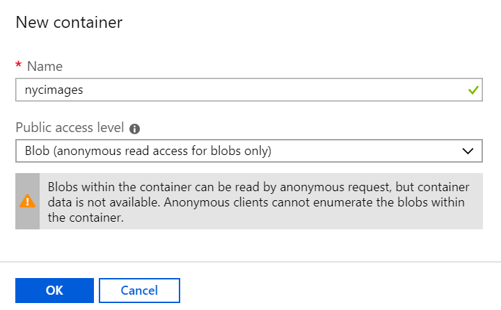
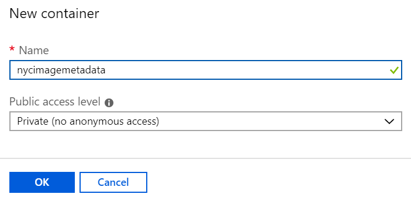
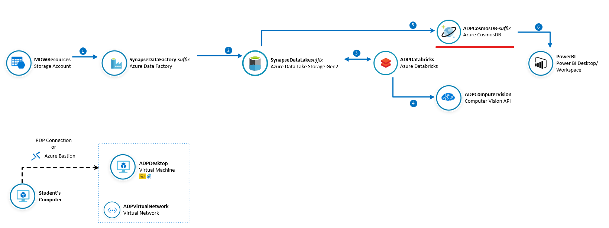
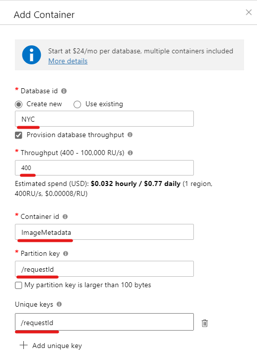
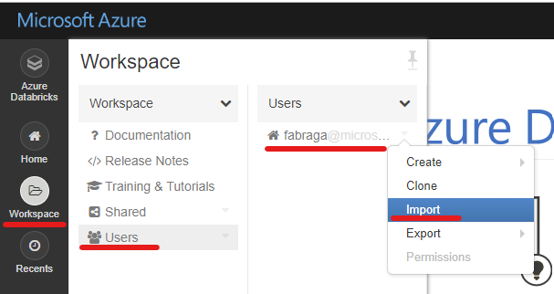

# Lab 4: Add AI to your Big Data Pipeline with Cognitive Services
In this lab you will use Azure Data Factory to download New York City images to your data lake. Then, as part of the same pipeline, you are going to use an Azure Databricks notebook to invoke Computer Vision Cognitive Service to generate metadata documents and save them in back in your data lake. The Azure Data Factory pipeline then finishes by saving all metadata information in a Cosmos DB collection. You will use Power BI to visualise NYC images and their AI-generated metadata.

The estimated time to complete this lab is: **60 minutes**.

## Lab Architecture

Step     | Description
-------- | -----
 | Build an Azure Data Factory Pipeline to copy image files from shared Azure Storage
 | Save image files to your data lake
 | For each image in your data lake, invoke an Azure Databricks notebook that will take the image URL as parameter
 | For each image call the Azure Computer Vision Cognitive service to generate image metadata. Metadata files are saved back in your data lake
 | Copy metadata JSON documents into your Cosmos DB database
 | Visualize images and associated metadata using Power BI

## Create NYCImages and NYCImageMetadata Containers in Azure Blob Storage
In this section you will create a container in your MDWDataLake that will be used as a repository for the NYC image files. You will copy 30 files from the MDWResources Storage Account into your NYCTaxiData container. 

**IMPORTANT**|
-------------|
**Execute these steps on your host computer**|

1.	In the Azure Portal, go to the lab resource group and locate the Azure Storage account **mdwdatalake*suffix***. 
2.	On the **Overview** panel, click **Blobs**.

    

3.	On the **mdwdalalake*suffix* – Blobs** blade, click **+ Container**.

    

4.	On the New container blade, enter the following details:
     - **Name**: nycimages
     - **Public access level**: Blob (anonymous read access for blobs only)
5.	Click **OK** to create the new container.

    

6.	Repeat the process to create the NYCImageMetadata container. This container will be used to host the metadata files generated by Cognitive Services before they can be saved in Cosmos DB.

    

7.	On the New container blade, enter the following details:
     - **Name**: nycimagemetadata
     - **Public access level**: Private (no anonymous access)
8.	Click **OK** to create the new container.

    

## Create CosmosDB database and collection
In this section you will create a CosmosDB database called NYC and a collection called ImageMetadata that will host New York image metadata information. 

**IMPORTANT**|
-------------|
**Execute these steps on your host computer**|

1.	In the Azure Portal, go to the lab resource group and locate the CosmosDB account **MDWCosmosDB-*suffix***. 
2.	On the **Overview** panel, click **+ Add Container**.
    
    

3.	On the **Add Container** blade, enter the following details:
     - **Database id > Create new**: NYC
     - **Container id**: ImageMetadata
     - **Partition key**: /requestId
     - **Throughput**: 400
     - **Unique keys**: /requestId
4.	Click **OK** to create the container.

    

## Import Databricks Notebook to Invoke Computer Vision Cognitive Services API
In this section you will import a Databricks notebook to your workspace and fill out the missing details about your Computer Vision API and your Data Lake account. This notebook will be executed from an Azure Data Factory pipeline and it will invoke the Computer Vision API to generate metadata about the images and save the result back to your data lake.

**IMPORTANT**|
-------------|
**Execute these steps on your host computer**|

1.	On the Azure Databricks portal, click the **Workspace** button on the left-hand side menu. 
2.	On the **Workspace** blade, click your username under the **Users** menu.
3.	On the **Users** blade, click the arrow next to your user name and then **Import**.

    

4.	On the **Import Notebooks** pop up window, select **Import from: URL**. Copy and paste the URL below in the box:

click the browse link to import the notebook file C:\ADSIAD\Lab\Lab4\NYCImageMetadata-Lab.dbc
5.	Click Import.
