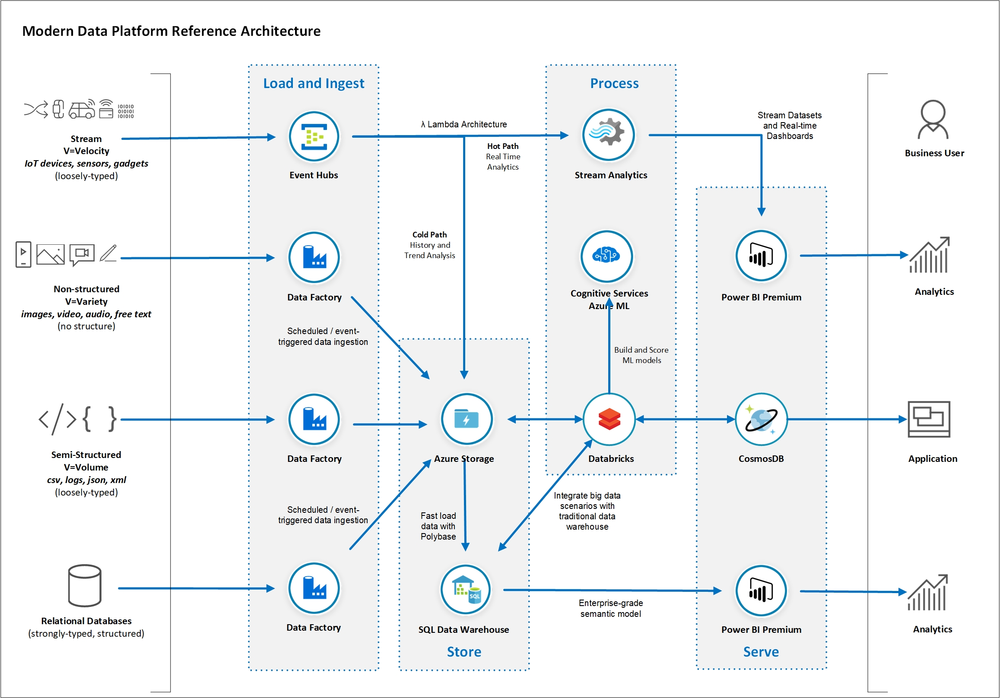

# Overview
In this workshop you will learn about the main concepts related to advanced analytics and Big Data processing and how Azure Data Services can be used to implement a modern data warehouse architecture. You will understand what Azure services you can leverage to establish a solid data platform to quickly ingest, process and visualise data from a large variety of data sources. The reference architecture you will build as part of this exercise has been proven to give you the flexibility and scalability to grow and handle large volumes of data and keep an optimal level of performance.
In the exercises in this lab you will build data pipelines using data related to New York City. The workshop was designed to progressively implement an extended modern data platform architecture starting from a traditional relational data pipeline. Then we introduce big data scenarios with large files and distributed computing. We add non-structured data and AI into the mix and finish with real-time streaming analytics. You will have done all of that by the end of the day.

## Document Structure
This document contains detailed step-by-step instructions on how to implement a Modern Data Platform architecture using Azure Data Services. It’s recommended you carefully read the detailed description contained in this document for a successful experience with all Azure services. 

You will see the label IMPORTANT whenever a there is a critical step to the lab. Please pay close attention to the instructions given.

You will also see the label IMPORTANT at the beginning of each lab section. As some instructions need to be execute on your host computer while others need to be executed in a remote desktop connection (RDP), it states where you should execute the lab section. See example below:

**IMPORTANT**|
-------------|
**Execute these steps on your host computer**|

## Data Source References
New York City data used in this lab was obtained from the New York City Open Data website: https://opendata.cityofnewyork.us/. The following datasets were used:
     - NYPD Motor Vehicle Collisions: https://data.cityofnewyork.us/Public-Safety/NYPD-Motor-Vehicle-Collisions/h9gi-nx95
     - TLC Yellow Taxi Trip Data: https://www1.nyc.gov/site/tlc/about/tlc-trip-record-data.page

## Lab Prerequisites
The following prerequisites must be completed before you start these labs:
     - You must be connected to the internet;
     - You must have an Azure account with administrator- or controbutor-level access to your subscription. If you don’t have an account, you can sign up for free following the instructions here: https://azure.microsoft.com/en-au/free/
     - Download Lab files from <insert GitHub link here> and save them in the local folder C:\ADSIAD\LabFiles;
     - Lab 5 requires you to have a Twitter account. If you don’t have an account you can sign up for free following the instructions here: https://twitter.com/signup. 
     - Lab 5 requires you to have a Power BI Pro account. If you don’t have an account you can sign up for a 60-day trial for free here: https://powerbi.microsoft.com/en-us/power-bi-pro/

# Deploy Azure Data Services in a Day to your subscription

You must deploy all Azure services required in each lab by running a PowerShell script as administrator on your local computer. We recommend you follow the instructions defined in Lab 0 – Provision Azure Resources for an automated deployment through ARM Templates and PowerShell. You can also deploy the resources manually through the Azure Portal by following the instructions in Appendix 1 – Manually Provision Azure Resources.
-	The ARM template used to automate the deployment of Azure services attempts to deploy all services required in the resource group default region. See more information on Lab 0.
